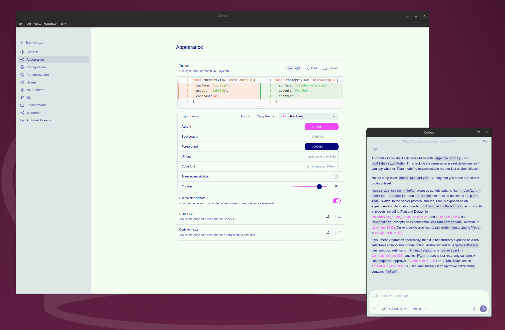

# codex-app

Codex desktop app packaging and release repository.

This repo tracks the Linux packaging pipeline for Codex and publishes installable release artifacts.

## Layout

- `desktop/`: Electron Forge workspace used to build Linux release packages
- `codex/`: canonical current upstream payload root used for the active Linux refresh line

GitHub release artifacts:
- Install from GitHub Releases using packaged artifacts (`.AppImage` / `.deb`).
- Built Linux installers are release-only outputs and are not tracked in git.
- Current Linux artifact versioning follows the embedded Electron app version `26.415.20818`; the embedded build number is `1727`.
- Release tags like `v26.415.20818` trigger `.github/workflows/linux-release.yml`.

## Notes

- Built installers and packaging outputs are release artifacts and should not be committed to git.
